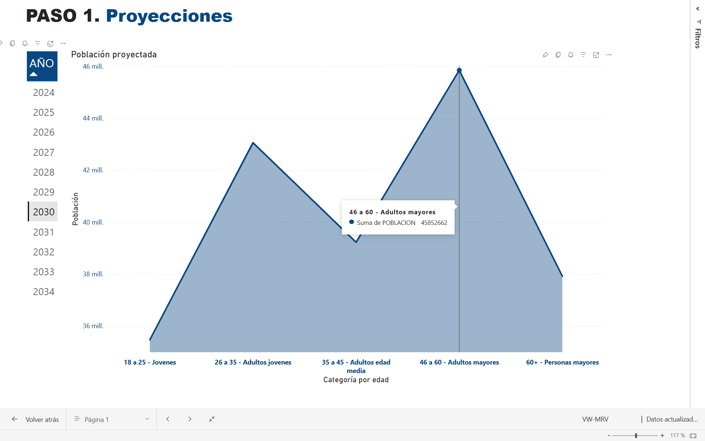

# Power BI Dashboard: Sales Analysis

This project showcases an interactive dashboard built in Power BI to demonstrate an efficient data processing workflow and ensure sales success.

## What's Included?

- Key metrics: Projected population through 2034, hypothesis testing, and relevant factors to consider.  
- Interactive year filters.  
- Dynamic visualizations.

## Preview

## Download the `.pbix` File

The file can be downloaded from the following link:

[Click here to open the file](https://www.dropbox.com/scl/fi/4hqccd7zc6a31aos9hokf/VW-MRV.pbix?rlkey=tkh3kngbnkaml6lfrdxlslgxm&st=2lquub70&dl=0)

> *Note: Power BI Desktop is required to open the file.*

## Author

Minnely Rosales – [LinkedIn](https://linkedin.com/in/minnelyrosales)
